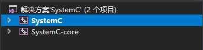
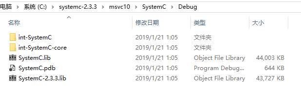
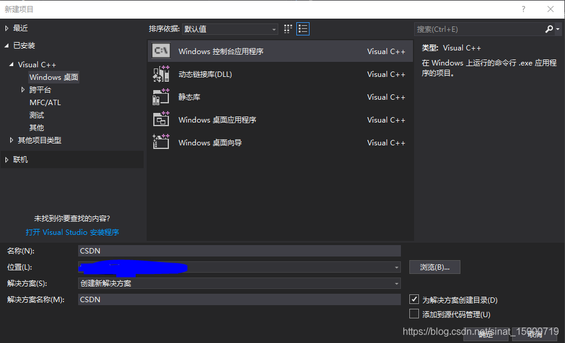
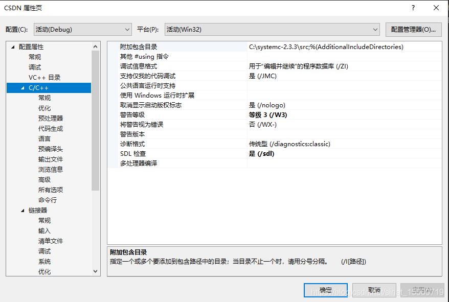
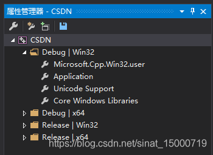
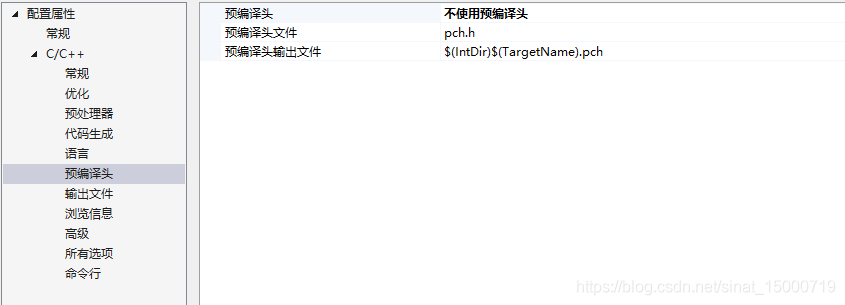
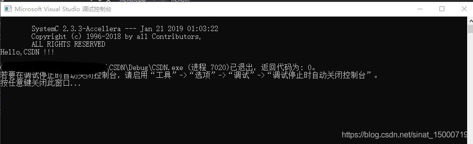
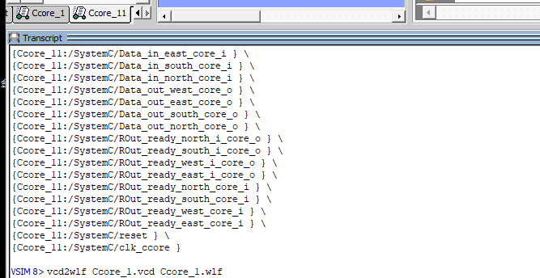
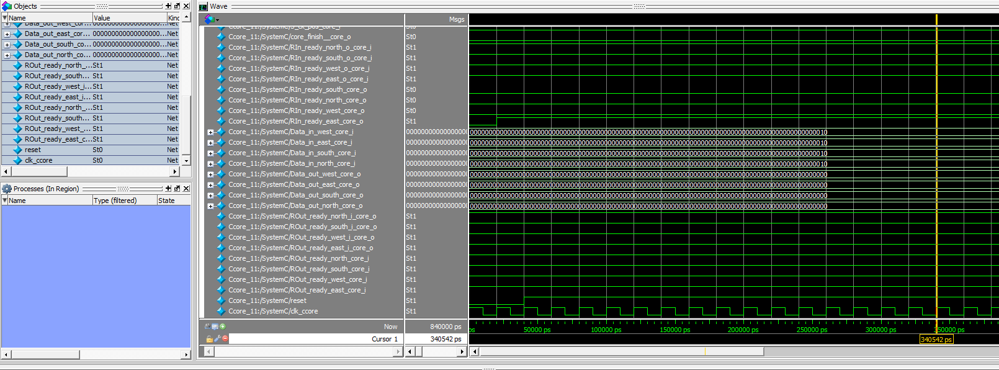

# SystemC安装

## 运行环境

**Visual Studio 2022 + modelsim/gtkwave（仿真）**

### Visual Studio安装
下载社区版即可：[Download Visual Studio Tools - Install Free for Windows, Mac, Linux (microsoft.com)](https://visualstudio.microsoft.com/downloads/)

同时注意需要在VS Installer中安装`v143`版本的工具集和`10.0`版本的Windows SDK（如10.0.22000）。

### 安装modelsim（2选1）

参考[Verilog作业](https://git.tsinghua.edu.cn/qixj23/homework)中的安装方法。

### 安装gtkwave（2选1）

需要安装iverilog，windows可以参考[win10下使用iverilog仿真+gtkwave/WaveDrom查看波形_gtkwave怎么看波形-CSDN博客](https://blog.csdn.net/lzl1342848782/article/details/124754271)

### 使用已经编译完成的SystemC库

从[链接](https://cloud.tsinghua.edu.cn/d/efd7ab3c17564e3bb160/)下载压缩包，解压后覆盖`libs/systemc-2.3.3`即可


### 在Visual Studio中安装SystemC库（可选）

#### systemC下载
SystemC库的源码是可以直接下载到的，下载链接：<https://accellera.org/downloads/standards/systemc>,链接里有各个版本的源代码，在这里我们用2.3.3版本。

#### 编译库文件

安装好VS2022后，首先把下载好的解压，在这里我放在C盘根目录下，在VS中打开`C:\systemc-2.3.3\msvc10\SystemC`  下的 `SystemC.sln`，点击生成开始编译



编译好之后会提示你编译成功，至于中间出现的warning可以忽略，此时你可以在`C:\systemc-2.3.3\msvc10\SystemC\Debug`文件下找到编译完成的库。



### 项目配置

**推荐直接使用提供的PropertySheet.props进行配置**：打开VS的属性管理器，右键项目名称，选择“Add Existing Property Sheet”然后选取项目文件夹下的`.props`文件。props文件中已经按照相对路径配置过下述路径。


新建名为CSDN的控制台项目



右击CSDN打开属性页




接下来做如下设置：

*C/C++：*

常规>>附加包含目录：添加 C:\systemc-2.3.3\src 项
语言>>启用运行时类型信息：选择“是”
命令行>>添加 /vmg /D_CRT_SECURE_NO_DEPRECATE

*链接器：*

常规>>附加库目录：添加 C:\systemc-2.3.3\msvc10\SystemC\Debug 项
输入>>附加依赖项：添加 SystemC.lib

以上，项目配置就基本完成了，不过每次你创建SystemC项目都要作如上配置比较麻烦，所以建议用如下方法一劳永逸，打开视图>>属性管理器，在左侧窗口会出现如下窗口，打开`Microsoft.Cpp.Win32.user`，对其做以上项目配置即可。



#### 环境测试
环境搭好后，在这里我们写一段简单程序进行测试：
`hello.h`

```
//hello.h
#ifndef  _HELLO_H
#define _HELLO_H
#include "systemc.h"

SC_MODULE(hello)
{
  SC_CTOR(hello) 
  { 
    cout << "Hello,CSDN !!!" << endl;
  }
};
#endif
```

`hello.cpp`

```
//hello.cpp
#include "hello.h"
int sc_main(int argc, char * argv[])
{
  hello  h("hello");
  return 0;
}

```

注意 在调试前应该将`hello.cpp`的预编译头选项修改为如下图所示：



开始调试，测试结果如下：




## 如何利用modelsim查看波形

在运行`tutorial`分支下的`MAC_array_demo`项目后会在`MAC_array_demo/results`文件夹中产生相对应的vcd文件，可以利用modelsim转换vcd文件成wlf文件（在modelsim下方的命令行中输入）

```
vcd2wlf timing.vcd timing.wlf
vsim -view timing.wlf
```






