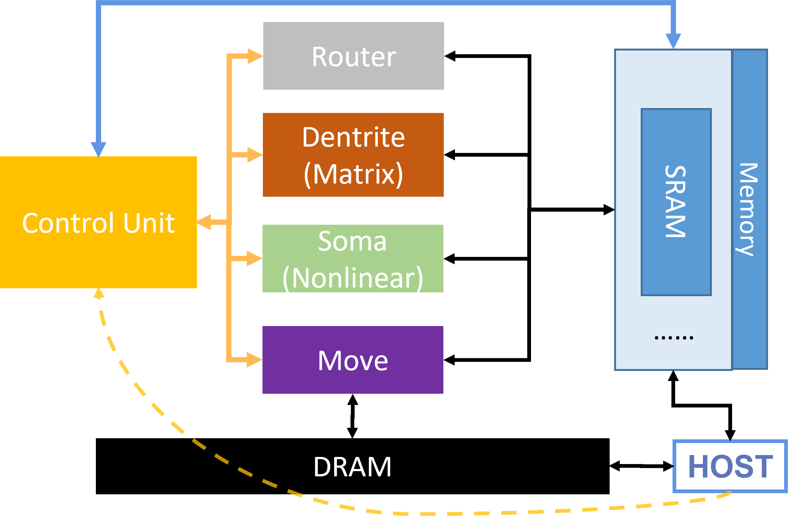

# 代码结构
行为级仿真器项目位于`chip_simulator_2023`文件夹下，文件夹中包含如下文件/文件夹：
```
- components/
- core/
- prims/
- test/
- trace_engine/
- utils/
- config.h
- [其他VS项目文件]
```
下面分类进行介绍。
## 芯片架构
与芯片硬件架构相关的文件位于`components/` `core/`两个文件夹中。
### Components/
主要定义了芯片存储等基础组件。此文件夹下的代码不要求看懂，但是必须会使用`ram<T>`和`dram<T>`类。
* `mem_if.h`：定义存储接口
* `ram_if.h`: 定义SRAM类（既是`sc_module`，也是`sc_channel`）
* `dram_if.h`: 定义SRAM类（既是`sc_module`，也是`sc_channel`）
其他文件与本次实验基本无关。
### core/
主要实现了功能核，即PPT中介绍的功能核架构：

* `core.h`定义了整个功能核的结构，包括模块的实例化、模块间的连线、模块与存储的连线等，建议仔细阅读
* `*_unit.h` `*_unit.cpp`定义了各个子模块，建议仔细阅读。尤其是`move`和`soma`模块对应的`.cpp`文件，与实验密切相关。
## 指令
所有指令的定义都位于`prims/`文件夹中。在这套行为级仿真器中，“指令”独立于硬件。指令集中的每个指令都有自己的类，定义在`prim_*.h`和`prim_*.cpp`中，所有指令的类都继承自`Primitive`类。建议大家仔细阅读`prim_*.h`和`prim_*.cpp`文件。
### 指令类的构成
每个指令类中的成员变量分为两类：一是指令代码，全都继承自`Primitive`类中的`prim_id_code_`；二是指令字段，每条指令中的每个字段都对应一个成员变量。在指令集中，指令代码给机器阅读，而指令字段和功能定义给人阅读。在仿真器中，指令代码主要用于存储的模拟，而指令字段方便大家进行功能实现。

每个指令类中最主要的成员函数是两个构造函数：一个将字段作为形参，构造出指令代码；另一个将指令代码作为形参，构造出各种字段。可以将前者理解为程序到机器码的编译过程，后者理解为机器的译码过程或人对指令代码的阅读过程。
## 测试
`test/`文件夹存放测试代码。`single_core_test_load_store.cpp`和`single_core_test_relu.cpp`分别是Load/Store指令的简单测试和ReLU指令的简单测试。

需要注意的是，`test/`中的`.cpp`文件中每个都有`int sc_main()`函数，都是项目运行的入口，所以在VS中运行前一定要保证只有一个test文件被包括在项目中。
